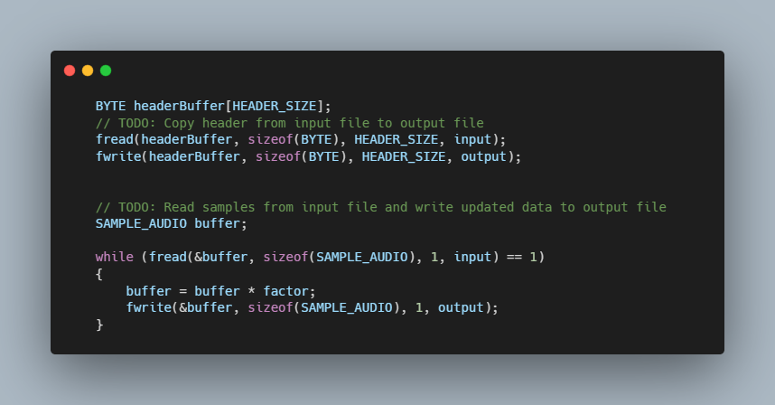

# CS50 - Volume

### Description

Writing a program to modify the volume of an audio file.
The program accepts three command-line arguments input, output and factor.
The program reads the header from the input file and writes the header to the output file
Then the rest of the data is read from the WAV file then multiplied by the factor.

### How to use

$ ./volume inout.wav output.wav 2.0
$ ./volume input.wav output.wav 0.5

### Code Snippet

### Links

For more information about CS50 - Volume visit: 

---------------------------------
[cs50 course](https://cs50.harvard.edu/x/2022/labs/4/)
---------------------------------------------------------------

